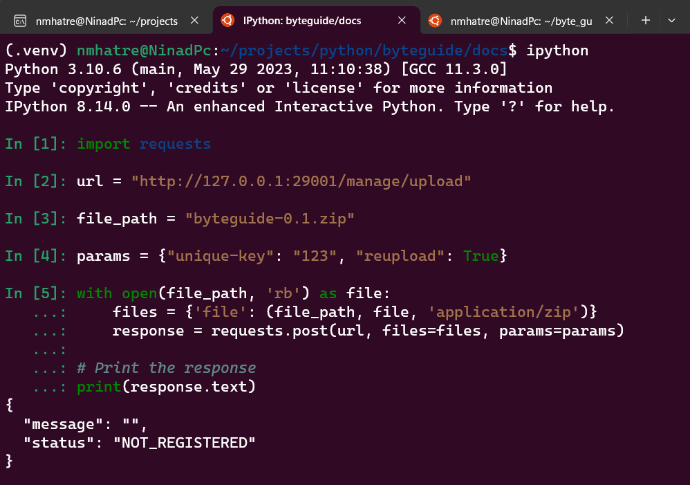
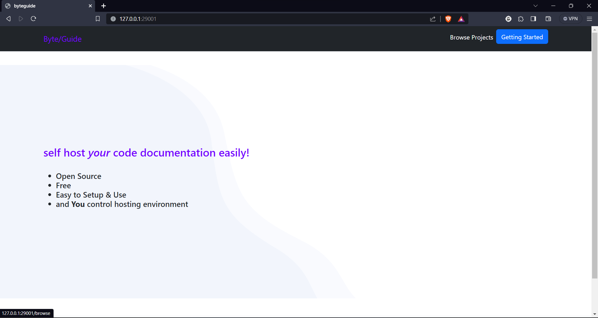
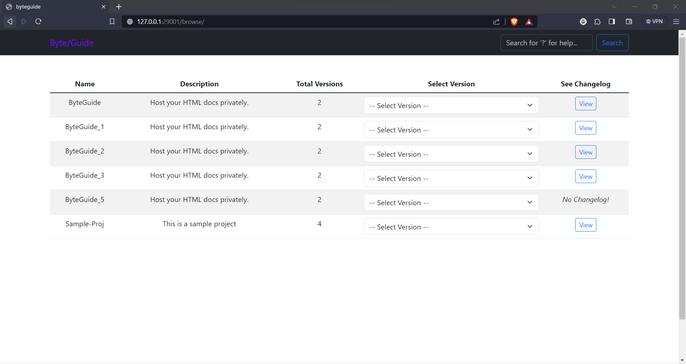
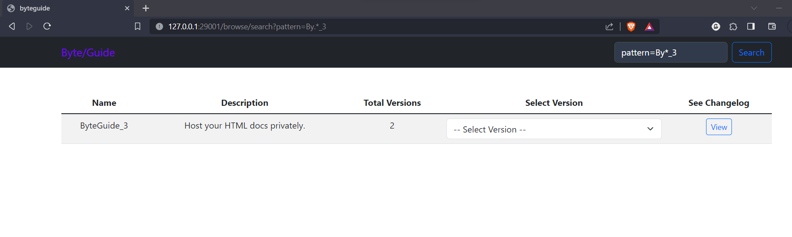
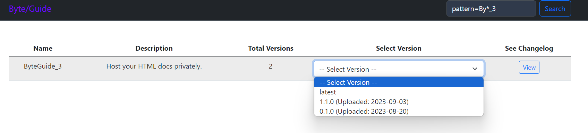
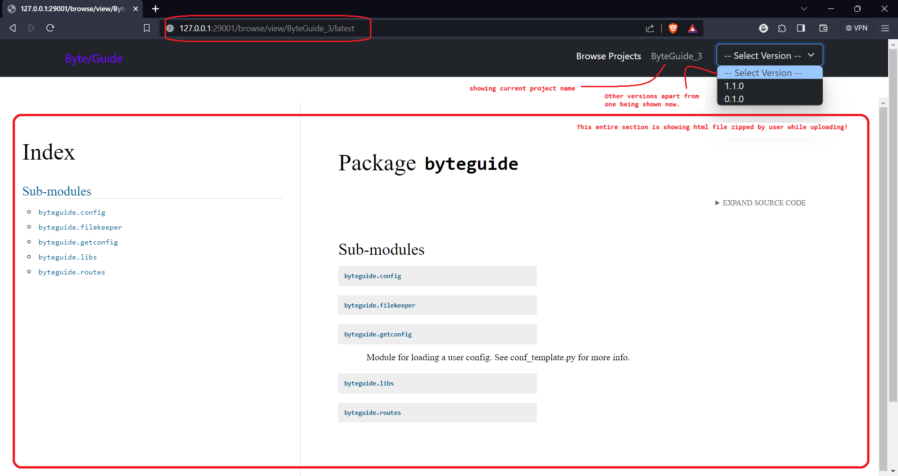
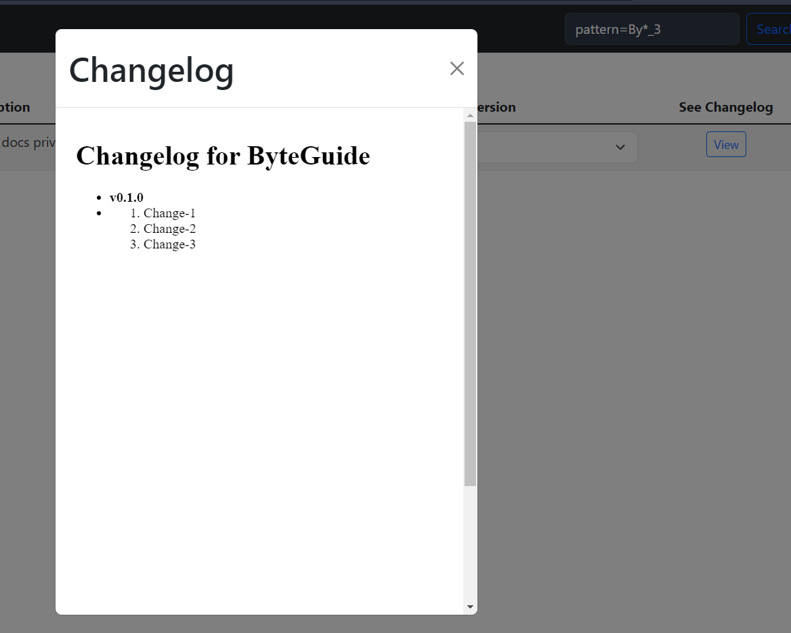

# Byteguide
Solution for hosting your HTML code docs (inspired by hostthedocs)

## Purpose

Created out of my personal need to host the code documents locally. It's created with following things

1. Documents must be hosted locally or internally.
2. Host limited number of projects (Few 100s).
3. Easy to upload docs with Curl
4. Host HTML docs of any programming language.

> It's not created to replace Confluence or similar hosting solutions.

## Getting Started

To start ByteGuide on your local machine, follow the steps below.

### Prerequisites

[Python](https://www.python.org/downloads/) 3.8 or larger is required to run ByteGuide. You can check your Python version by running `python --version` in your terminal.

### Using Poetry

1. Install [Poetry](https://python-poetry.org/docs/#installation).
2. Git clone the repository and `cd` into it.
3. Run `poetry install` to install the dependencies in a virtual environment.
4. Run `poetry run python start_server.py` to start the server. With default settings you will find the server running at `http://localhost:29001`.

Next go to the address of the server in your browser and you should see the landing page. Click on the `Getting Started` button in the upper right corner to read the documentation.

## Screenshots

### 1. Upload

### 2. Landing Page

### 3. Browse Projects

### 4. Search

### 5. Version Selection

### 6. Viewing Docs

### 7. Changelog

